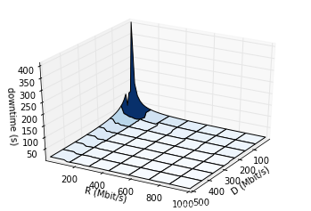
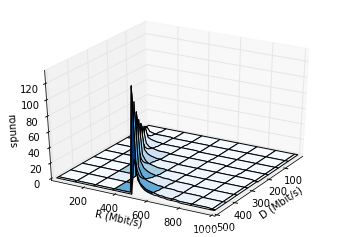
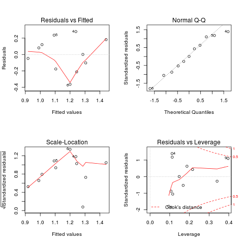

# Pervasive Cloud Controller for Geotemporal Inputs

Supplementary materials as part of the journal paper submitted to
*IEEE Transactions on Cloud Computing: Special Issue on Green and
Energy-Efficient Cloud Computing.* Here, we share some additional
details related to the topic that did not fit inside the paper itself.

For any questions, contact the corresponding author
<a href="http://www.infosys.tuwien.ac.at/staff/drazen/"
style="font-family: 'Helvetica Neue', Helvetica, Arial, sans-serif;">
Dražen Lučanin</a>.

## Geotemporal Inputs

To illustrate the dynamic environment caused by geotemporal inputs,
the following animation shows real-time electricity prices and temperatures
change over the same geographic region during a period of 24 hours.

 

## Simulator

For all the details of the Philharmonic simulator visit [the project page](/).
There you will find the instructions for installing and using it.
The version of the code released for the paper is accessible
under the [TCC tag](https://github.com/philharmonic/philharmonic/tree/TCC/).

## Model

The details of the migration model implemented in
[the evaluator](https://github.com/philharmonic/philharmonic/blob/TCC/philharmonic/scheduler/evaluator.py)
are visualised in the following two graphs showing the downtime duration and the
number of pre-copying rounds depending on different network speed (R) and
memory dirtying rates (D).

## Evaluation

The details of the linear regression model of the dependence of cloud
energy costs on temperature variability shown in the evaluation can be
seen in the following figure - the Q-Q plot shows a good fit.

