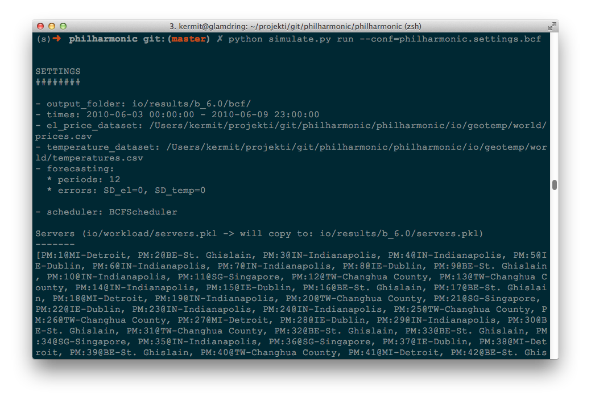
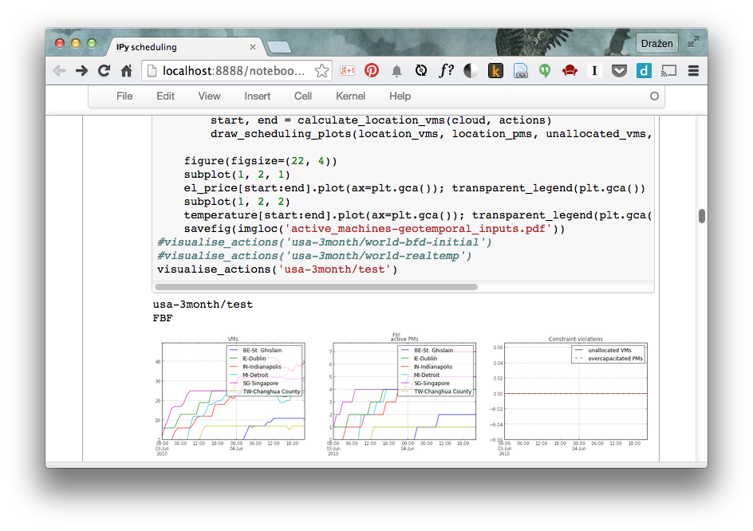

### Welcome to Philharmonic

Philharmonic is a cloud simulator developed in Python to realistically model
geographically-distributed data centers influenced by real-time electricity
prices and temperature-dependent cooling efficiency that we call
*geotemporal inputs*. To illustrate the dynamic environment caused by
geotemporal inputs, the following animation shows real-time electricity prices
and temperatures change over the same geographic region during
a period of 24 hours.

 

Philharmonic can simulate different scheduling algorithms and
calculate their effects in terms of energy consumption, costs, cooling overhead
and service quality.

For a part of the functionality (namely VM pausing), Philharmonic can interact
with a real OpenStack deployment and it offers a way to collect power
measurements from Eaton wattmeters. This experimental approach is no longer
the focus of development, however.


### Installation

For installation details see
[these instructions](https://github.com/philharmonic/philharmonic#installation).


### Usage

Philharmonic is used through a command line interface (CLI).

[](img/philharmonic-terminal.png)

The first step is to generate the random input data.

    python simulate.py inputgen --conf=philharmonic.settings.bcf

You can then run the simulation.

    python simulate.py run --conf=philharmonic.settings.bcf

The simulation results are serialised data frames that can be parsed and
analysed in Python using scientific libraries such as
[Pandas](http://pandas.pydata.org/) and [Matplotlib](http://matplotlib.org/),
e.g. in the integrated [IPython notebook](http://ipython.org/notebook.html)
environment.

[](img/philharmonic-notebook.png)

For more information on usage,
consult the [README](https://github.com/philharmonic/philharmonic#running).


### Datasets

The datasets of real-time electricity prices and temperatures that can be used
in the simulator are described
[here](https://github.com/philharmonic/philharmonic/tree/master/io/geotemp).


### Authors and Contributors

The simulator was created by
[Dražen Lučanin](http://www.infosys.tuwien.ac.at/staff/drazen/)
during his PhD study at the
Vienna University of Technology.

Contributions to the project were made by
[Ilia Pietri](http://www.researchgate.net/profile/Ilia_Pietri) from the
University of Manchester, UK and
[Simon Holmbacka](http://www.researchgate.net/profile/Simon_Holmbacka)
from Åbo Akademi University, Turku, Finland.


### Contact and Support

Interested in using Philharmonic and having trouble with it? Feel free to
[file a ticket](https://github.com/philharmonic/philharmonic/issues) or
[contact me directly](http://kermit.epska.org/about/).

If you find this simulator useful for your research, please consider citing
one of the papers where we wrote about its architecture, datasets and
scheduling algorithms. This is the paper where we first described it:

```
Dražen Lučanin, Foued Jrad, Ivona Brandić, and Achim Streit.
Energy-Aware Cloud Management through Progressive SLA Specification.
Economics of Grids, Clouds, Systems, and Services - 11th International
Conference (GECON 2014). 16-18 September, 2014, Cardiff, UK.
```
([arXiv](http://arxiv.org/abs/1409.0325),
[SpringerLink](http://link.springer.com/chapter/10.1007/978-3-319-14609-6_6))

This journal paper gives a much more detailed overview of the simulator,
cloud model and presents the Genetic Algorithm and Best Cost Fit schedulers:

```
Dražen Lučanin, Ivona Brandić.
Pervasive Cloud Controller for Geotemporal Inputs.
IEEE Transactions on Cloud Computing (TCC), 2015.
```
([IEEE Xplore](http://ieeexplore.ieee.org/xpl/articleDetails.jsp?arnumber=7180314))

The Best Cost Fit Frequency Scaling scheduler is explained in this conference
paper:

```
Dražen Lučanin, Ilia Pietri, Ivona Brandić, Rizos Sakellariou.
A Cloud Controller for Performance-Based Pricing.
8th IEEE International Conference on Cloud Computing (CLOUD 2015),
27 June – 2 July, 2015, New York, USA.
```
([IEEE Xplore](http://ieeexplore.ieee.org/xpl/articleDetails.jsp?arnumber=7214040))
